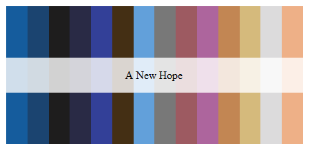

### Star Wars Palette: _A New Hope_



##### Insert the text below to your Tableau `"Preferenecs.tps"` file.  By default this file is located in:  
> `My Documents\My Tableau Repository`

---  

##### Palette text:
```{html}
<workbook> 
	 <preferences>
         <color-palette name="A New Hope" type="regular"> 
			 <color> #155C9D </color> 
			 <color> #1B4470 </color> 
			 <color> #1E1D1D </color> 
			 <color> #292A45 </color> 
			 <color> #334098 </color> 
			 <color> #442F14 </color> 
			 <color> #62A0DA </color> 
			 <color> #787878 </color> 
			 <color> #9D5A61 </color> 
			 <color> #AD659D </color> 
			 <color> #C28653 </color> 
			 <color> #D5BA7C </color> 
			 <color> #DCDBDC </color> 
			 <color> #EEB087 </color> 
		 </color-palette> 
	 </preferences> 
 </workbook>
 ```
