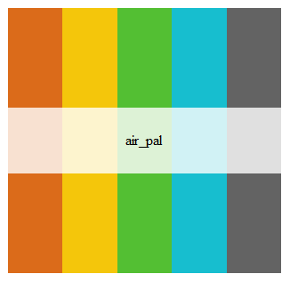

```{r setup, include=FALSE}
knitr::opts_chunk$set(echo = TRUE)
```

### Air Toxics Palette

[Link to Github page](https://github.com/Data-Analysis-Users-Group/Tableau-Resources/tree/master/Colors/Air_Toxics)



##### Add the text below to your Tableau `"Preferenecs.tps"` file.  By default this file is located in:  
> `My Documents\My Tableau Repository`

---  

##### Palette text:
```{html}
<workbook> 
	 <preferences>
         <color-palette name="Air Toxics" type="regular"> 
			 <color> #DB6B1A </color> 
			 <color> #F4C60B </color> 
			 <color> #53BF33 </color> 
			 <color> #17BECF </color> 
			 <color> #636363 </color> 
		 </color-palette> 
	 </preferences> 
 </workbook>
 ```

##### RGB color codes  

Orange <- c(219,107,26)  
Yellow <- c(244,198,11)  
Green  <- c(83,191,51)  
Blue   <- c(23,190,207)  
Grey   <- c(99,99,99)  
  
##### Create palette image
``` r
library(wesanderson)
library(rPlotter)
library(grDevices)

# Orange, #DB6B1A
rgb(219,107,26, maxColorValue=255)  

# Yellow, #F4C60B
rgb(244,198,11, maxColorValue=255)

# Green, #53BF33
rgb(83,191,51, maxColorValue=255)

# Blue, #17BECF
rgb(23,190,207, maxColorValue=255)

# Gray, #636363
rgb(99,99,99, maxColorValue=255)

air_pal <- c("#DB6B1A", "#F4C60B", "#53BF33", "#17BECF", "#636363")

structure(air_pal, class = "palette", name = "air_pal")

```

