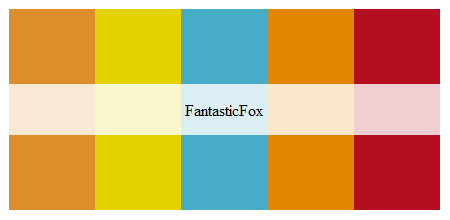

### Fantastic Mr. Fox Palette



##### Insert the text below into your Tableau `"Preferenecs.tps"` file.  By default this file is located in:  
> `My Documents\My Tableau Repository`

---  

##### Palette text:
```{html}
<workbook> 
	 <preferences>
          <color-palette name="Fantastic Fox" type="regular"> 
			 <color> #DD8D29 </color> 
			 <color> #E2D200 </color> 
			 <color> #46ACC8 </color> 
			 <color> #E58601 </color> 
			 <color> #B40F20 </color> 
		 </color-palette> 
	 </preferences> 
 </workbook>
 ```
