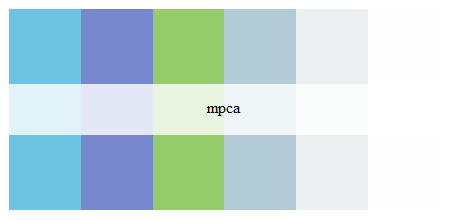

### MPCA Logo Palette



##### Insert the text below into your Tableau `"Preferenecs.tps"` file.  By default this file is located in:  
> `My Documents\My Tableau Repository`

---  

##### Palette text:
```{html}
<workbook> 
	 <preferences>
         <color-palette name="MPCA Logo" type="regular"> 
			 <color> #6CC4E2 </color> 
			 <color> #7888CD </color> 
			 <color> #95CC6B </color> 
			 <color> #B2CBD7 </color> 
			 <color> #ECF0F0 </color> 
		 </color-palette> 
	 </preferences> 
 </workbook>
 ```

